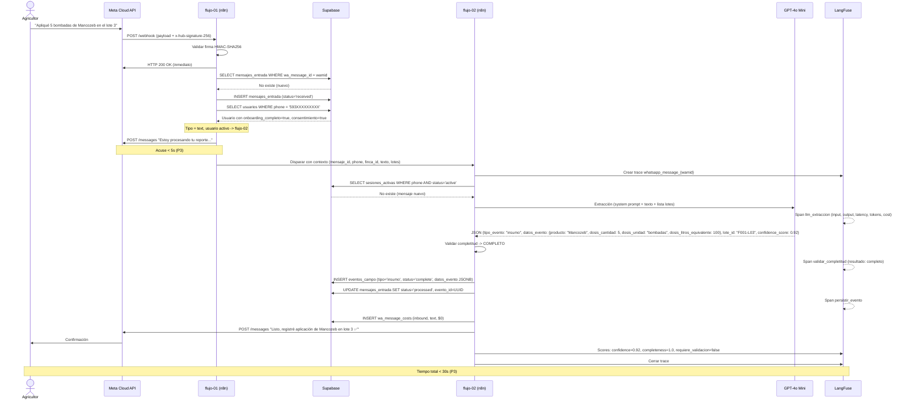
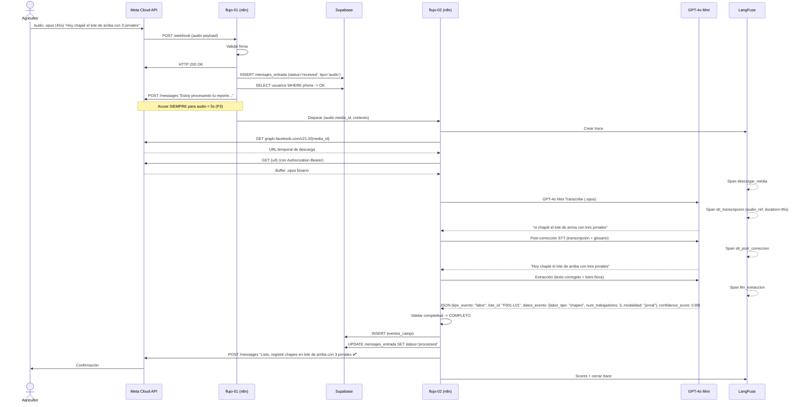
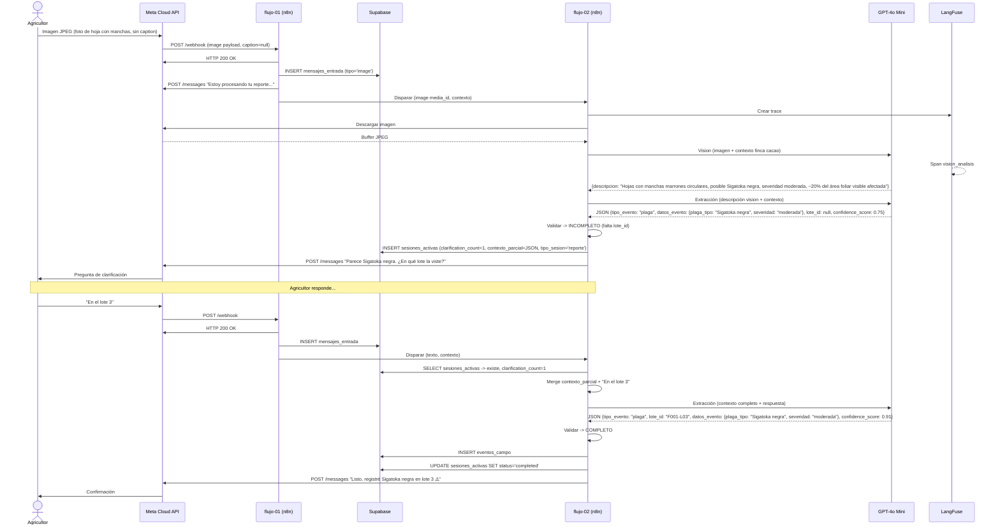
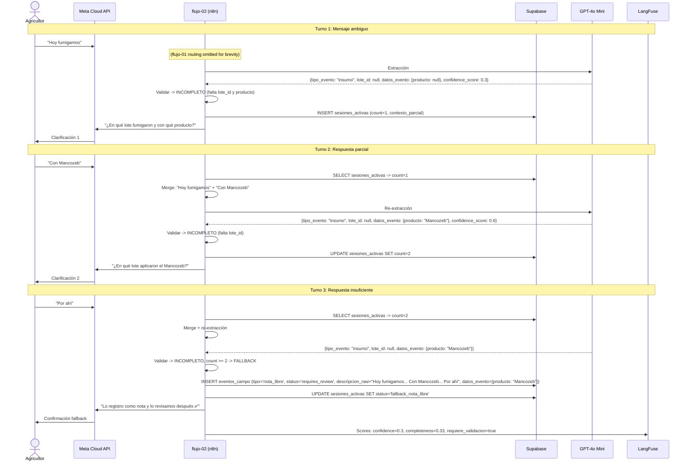
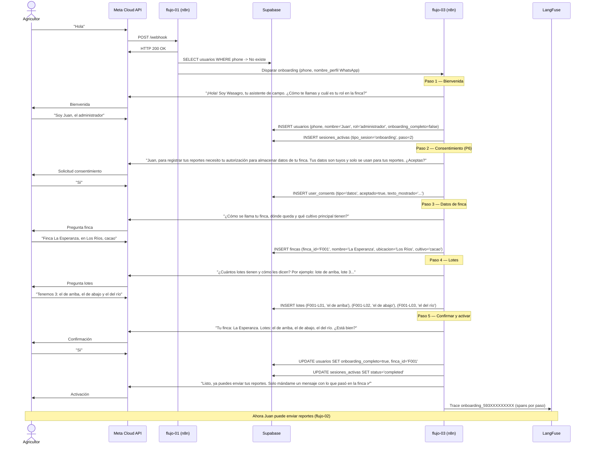

# Design: pipeline-procesamiento-whatsapp

> Change: pipeline-procesamiento-whatsapp | Phase: sdd-design | Date: 2026-04-10

---

## Architecture Overview

```
                                    WASAGRO H0 — Pipeline de Procesamiento WhatsApp
                                    ================================================

  ┌──────────────┐     ┌────────────────────────────────────────────────────────────────────────┐
  │  Agricultor  │     │                          n8n (Orquestador)                              │
  │  (WhatsApp)  │     │                                                                        │
  └──────┬───────┘     │  ┌──────────────────┐    ┌──────────────────┐   ┌───────────────────┐  │
         │             │  │  flujo-01         │    │  flujo-02        │   │  flujo-03         │  │
         │  mensaje    │  │  Recibir Mensaje  │───>│  Procesar        │   │  Onboarding       │  │
         ▼             │  │                   │    │  Reporte         │   │  Conversacional   │  │
  ┌──────────────┐     │  │  - Webhook        │    │                  │   │                   │  │
  │  Meta Cloud  │────>│  │  - Validar firma  │    │  - STT (.opus)   │   │  - Consentimiento │  │
  │  API         │     │  │  - Idempotencia   │    │  - Post-correc.  │   │  - Perfil finca   │  │
  │  (WhatsApp)  │<────│  │  - Autenticar     │    │  - Vision (img)  │   │  - Lista lotes    │  │
  └──────────────┘     │  │  - Enrutar        │    │  - Extraccion    │   │  - Activar        │  │
                       │  │  - Acuse recibo   │    │  - Clarificacion │   └───────────────────┘  │
                       │  └──────────────────┘    │  - Persistir     │                          │
                       │                          └──────────────────┘   ┌───────────────────┐  │
                       │                                                 │  flujo-04         │  │
                       │                                                 │  Reporte Semanal  │  │
                       │                                                 │  (Cron lunes 6AM) │  │
                       │                                                 └───────────────────┘  │
                       └─────────────────────────────┬──────────────────────────────────────────┘
                                                     │
                       ┌─────────────────────────────┼──────────────────────────────────┐
                       │                             │                                  │
                       ▼                             ▼                                  ▼
              ┌─────────────────┐          ┌─────────────────┐                ┌─────────────────┐
              │  Supabase       │          │  GPT-4o Mini    │                │  LangFuse       │
              │  (PostgreSQL)   │          │  (OpenAI)       │                │  (self-hosted)  │
              │                 │          │                 │                │                 │
              │  - usuarios     │          │  - Transcribe   │                │  - Traces       │
              │  - fincas       │          │  - Chat (text)  │                │  - Spans        │
              │  - lotes        │          │  - Vision (img) │                │  - Scores       │
              │  - eventos_campo│          │                 │                │  - Eval datasets│
              │  - mensajes_    │          └─────────────────┘                └─────────────────┘
              │    entrada      │
              │  - sesiones_    │
              │    activas      │
              │  - user_consents│
              │  - wa_message_  │
              │    costs        │
              │                 │
              │  RLS por finca  │
              │  PostGIS        │
              └─────────────────┘
```

**Data flow summary:**

1. Agricultor sends WhatsApp message (text/audio/image)
2. Meta Cloud API delivers webhook to n8n (flujo-01)
3. flujo-01 validates, authenticates, deduplicates, routes
4. flujo-02 processes: STT/Vision if needed, LLM extraction, validation, clarification loop, persistence
5. flujo-03 handles new user onboarding (blocking gate)
6. flujo-04 generates weekly summaries on cron
7. Every LLM/STT call is traced in LangFuse
8. All structured data persists in Supabase with RLS isolation

---

## Sequence Diagrams

### SD-01: Mensaje de texto completo (happy path)



### SD-02: Mensaje de audio con post-corrección STT



### SD-03: Imagen sin caption -> clarificación -> completar



### SD-04: Flujo de clarificación (2 turnos -> fallback nota_libre)



### SD-05: Primer contacto -> onboarding -> primer reporte



---

## SQL Schema (complete DDL)

### 01-schema-core.sql

```sql
-- =============================================================================
-- Wasagro H0 — Schema Core
-- Archivo: backend/sql/01-schema-core.sql
-- Descripción: Tablas principales del sistema. Ejecutar PRIMERO.
-- =============================================================================

-- Extensiones requeridas
CREATE EXTENSION IF NOT EXISTS "uuid-ossp";
CREATE EXTENSION IF NOT EXISTS "postgis";

-- ─────────────────────────────────────────────────────────────────────────────
-- ENUMS
-- ─────────────────────────────────────────────────────────────────────────────

CREATE TYPE tipo_evento AS ENUM (
    'labor',
    'insumo',
    'plaga',
    'clima',
    'cosecha',
    'gasto',
    'observacion',
    'nota_libre'
);

CREATE TYPE status_evento AS ENUM (
    'draft',
    'complete',
    'requires_review'
);

CREATE TYPE rol_usuario AS ENUM (
    'agricultor',
    'administrador',
    'gerente',
    'propietario',
    'tecnico'
);

-- ─────────────────────────────────────────────────────────────────────────────
-- TABLA: fincas
-- ─────────────────────────────────────────────────────────────────────────────

CREATE TABLE fincas (
    finca_id       TEXT PRIMARY KEY,                              -- F001, F002, ...
    nombre         TEXT NOT NULL,
    ubicacion      TEXT,                                          -- Departamento/provincia
    pais           TEXT DEFAULT 'EC',                             -- EC, GT
    cultivo_principal TEXT,                                       -- cacao, banano
    coordenadas    geography(POINT, 4326),                        -- Centroide de la finca
    poligono       geography(POLYGON, 4326),                      -- Perímetro EUDR (6 decimales)
    hectareas_total NUMERIC(8,2),
    activa         BOOLEAN DEFAULT true,
    created_at     TIMESTAMPTZ DEFAULT NOW(),
    updated_at     TIMESTAMPTZ DEFAULT NOW()
);

-- ─────────────────────────────────────────────────────────────────────────────
-- TABLA: usuarios
-- ─────────────────────────────────────────────────────────────────────────────

CREATE TABLE usuarios (
    id                   UUID PRIMARY KEY DEFAULT gen_random_uuid(),
    phone                TEXT NOT NULL UNIQUE,                     -- 593XXXXXXXXX (sin +)
    nombre               TEXT,
    rol                  rol_usuario DEFAULT 'agricultor',
    finca_id             TEXT REFERENCES fincas(finca_id),
    onboarding_completo  BOOLEAN DEFAULT false,
    consentimiento_datos BOOLEAN DEFAULT false,
    idioma               TEXT DEFAULT 'es',
    created_at           TIMESTAMPTZ DEFAULT NOW(),
    updated_at           TIMESTAMPTZ DEFAULT NOW()
);

CREATE INDEX idx_usuarios_phone ON usuarios(phone);
CREATE INDEX idx_usuarios_finca ON usuarios(finca_id);

-- ─────────────────────────────────────────────────────────────────────────────
-- TABLA: lotes
-- ─────────────────────────────────────────────────────────────────────────────

CREATE TABLE lotes (
    lote_id          TEXT PRIMARY KEY,                             -- F001-L01, F001-L02, ...
    finca_id         TEXT NOT NULL REFERENCES fincas(finca_id),
    nombre_coloquial TEXT NOT NULL,                                -- "el de arriba", "lote 3"
    cultivo          TEXT,                                         -- Hereda de finca si null
    hectareas        NUMERIC(8,2),
    coordenadas      geography(POINT, 4326),
    poligono         geography(POLYGON, 4326),
    activo           BOOLEAN DEFAULT true,
    created_at       TIMESTAMPTZ DEFAULT NOW(),
    updated_at       TIMESTAMPTZ DEFAULT NOW()
);

CREATE INDEX idx_lotes_finca ON lotes(finca_id);

-- ─────────────────────────────────────────────────────────────────────────────
-- TABLA: eventos_campo
-- ─────────────────────────────────────────────────────────────────────────────

CREATE TABLE eventos_campo (
    id                  UUID PRIMARY KEY DEFAULT gen_random_uuid(),
    finca_id            TEXT NOT NULL REFERENCES fincas(finca_id),
    lote_id             TEXT REFERENCES lotes(lote_id),            -- Nullable: clima/gasto sin lote
    tipo_evento         tipo_evento NOT NULL,
    status              status_evento NOT NULL DEFAULT 'draft',
    datos_evento        JSONB NOT NULL DEFAULT '{}',               -- Campos específicos por tipo
    descripcion_raw     TEXT NOT NULL,                              -- Input original sin procesar (P5)
    confidence_score    NUMERIC(3,2),                              -- 0.00 - 1.00
    requiere_validacion BOOLEAN DEFAULT false,
    fecha_evento        DATE DEFAULT CURRENT_DATE,                 -- Fecha del evento (puede diferir de created_at)
    created_by          UUID REFERENCES usuarios(id),
    mensaje_id          UUID,                                      -- FK a mensajes_entrada (set after that table exists)
    severidad           TEXT,                                       -- Estructura para H1 alertas (solo columna, no lógica)
    created_at          TIMESTAMPTZ DEFAULT NOW(),
    updated_at          TIMESTAMPTZ DEFAULT NOW()
);

CREATE INDEX idx_eventos_finca ON eventos_campo(finca_id);
CREATE INDEX idx_eventos_lote ON eventos_campo(lote_id);
CREATE INDEX idx_eventos_tipo ON eventos_campo(tipo_evento);
CREATE INDEX idx_eventos_status ON eventos_campo(status);
CREATE INDEX idx_eventos_fecha ON eventos_campo(fecha_evento);
CREATE INDEX idx_eventos_created_at ON eventos_campo(created_at);
CREATE INDEX idx_eventos_finca_fecha ON eventos_campo(finca_id, fecha_evento);

-- ─────────────────────────────────────────────────────────────────────────────
-- RLS (Row Level Security) — P5: datos pertenecen a la finca
-- ─────────────────────────────────────────────────────────────────────────────

ALTER TABLE fincas ENABLE ROW LEVEL SECURITY;
ALTER TABLE usuarios ENABLE ROW LEVEL SECURITY;
ALTER TABLE lotes ENABLE ROW LEVEL SECURITY;
ALTER TABLE eventos_campo ENABLE ROW LEVEL SECURITY;

-- Política: usuario ve solo datos de su finca
-- auth.uid() es el UUID de Supabase Auth; se vincula via usuarios.id

CREATE POLICY "usuarios_own_finca" ON usuarios
    FOR ALL
    USING (id = auth.uid());

CREATE POLICY "fincas_by_user" ON fincas
    FOR ALL
    USING (
        finca_id IN (
            SELECT u.finca_id FROM usuarios u WHERE u.id = auth.uid()
        )
    );

CREATE POLICY "lotes_by_finca" ON lotes
    FOR ALL
    USING (
        finca_id IN (
            SELECT u.finca_id FROM usuarios u WHERE u.id = auth.uid()
        )
    );

CREATE POLICY "eventos_by_finca" ON eventos_campo
    FOR ALL
    USING (
        finca_id IN (
            SELECT u.finca_id FROM usuarios u WHERE u.id = auth.uid()
        )
    );

-- Política para service_role (n8n usa service_role key, bypasses RLS)
-- n8n accede con service_role que tiene bypass inherente en Supabase.
-- No se necesitan políticas adicionales para el pipeline.
```

### 02-patch-user-consents.sql

```sql
-- =============================================================================
-- Wasagro H0 — Parche: Consentimientos de usuario
-- Archivo: backend/sql/02-patch-user-consents.sql
-- Prioridad: BLOQUEANTE LEGAL (P6)
-- Descripción: Tabla de consentimientos documentados. Sin esta tabla no se puede
--              capturar ningún dato legalmente. Cada consentimiento registra el
--              texto exacto mostrado al usuario y su respuesta.
-- =============================================================================

CREATE TABLE user_consents (
    id              UUID PRIMARY KEY DEFAULT gen_random_uuid(),
    user_id         UUID NOT NULL REFERENCES usuarios(id) ON DELETE CASCADE,
    phone           TEXT NOT NULL,
    tipo            TEXT NOT NULL CHECK (tipo IN ('datos', 'comunicaciones', 'ubicacion')),
    texto_mostrado  TEXT NOT NULL,                                 -- Texto EXACTO que se le mostró
    aceptado        BOOLEAN NOT NULL,
    ip_address      TEXT,                                          -- Opcional, si disponible
    created_at      TIMESTAMPTZ DEFAULT NOW()
);

-- No UPDATE ni DELETE — cada cambio de consentimiento es un nuevo registro (auditoría inmutable)
-- Para obtener el consentimiento vigente: ORDER BY created_at DESC LIMIT 1

CREATE INDEX idx_consents_user ON user_consents(user_id);
CREATE INDEX idx_consents_phone ON user_consents(phone);
CREATE INDEX idx_consents_tipo_user ON user_consents(user_id, tipo, created_at DESC);

ALTER TABLE user_consents ENABLE ROW LEVEL SECURITY;

CREATE POLICY "consents_own_user" ON user_consents
    FOR ALL
    USING (user_id = auth.uid());
```

### 03-patch-sesiones-activas.sql

```sql
-- =============================================================================
-- Wasagro H0 — Parche: Sesiones activas
-- Archivo: backend/sql/03-patch-sesiones-activas.sql
-- Prioridad: BLOQUEANTE OPERATIVO (R2 — máx 2 clarificaciones)
-- Descripción: Estado de sesión conversacional. TTL 30 min.
--              Soporta tipo reporte (clarificaciones) y onboarding (pasos).
-- =============================================================================

CREATE TABLE sesiones_activas (
    session_id          UUID PRIMARY KEY DEFAULT gen_random_uuid(),
    phone               TEXT NOT NULL,
    finca_id            TEXT REFERENCES fincas(finca_id),
    tipo_sesion         TEXT NOT NULL CHECK (tipo_sesion IN ('reporte', 'onboarding')),
    clarification_count INTEGER DEFAULT 0 CHECK (clarification_count >= 0 AND clarification_count <= 3),
    paso_onboarding     INTEGER,                                   -- 1-5, solo si tipo_sesion='onboarding'
    contexto_parcial    JSONB DEFAULT '{}',                        -- Extracción incompleta o datos parciales
    ultimo_mensaje_at   TIMESTAMPTZ DEFAULT NOW(),
    expires_at          TIMESTAMPTZ DEFAULT (NOW() + INTERVAL '30 minutes'),
    status              TEXT DEFAULT 'active' CHECK (status IN ('active', 'completed', 'fallback_nota_libre', 'expired')),
    created_at          TIMESTAMPTZ DEFAULT NOW()
);

-- Índice principal: buscar sesión activa por teléfono
CREATE INDEX idx_sesiones_phone_status ON sesiones_activas(phone, status) WHERE status = 'active';
CREATE INDEX idx_sesiones_expires ON sesiones_activas(expires_at) WHERE status = 'active';

ALTER TABLE sesiones_activas ENABLE ROW LEVEL SECURITY;

-- Las sesiones se gestionan por service_role (n8n). No hay acceso directo del usuario.
-- RLS habilitado pero sin política para auth.uid() — solo service_role opera esta tabla.
```

### 04-patch-mensajes-entrada.sql

```sql
-- =============================================================================
-- Wasagro H0 — Parche: Mensajes de entrada
-- Archivo: backend/sql/04-patch-mensajes-entrada.sql
-- Prioridad: BLOQUEANTE (idempotencia contra reintentos de Meta)
-- Descripción: Log de mensajes entrantes. wa_message_id UNIQUE garantiza
--              idempotencia contra reintentos de Meta Cloud API.
-- =============================================================================

CREATE TABLE mensajes_entrada (
    id              UUID PRIMARY KEY DEFAULT gen_random_uuid(),
    wa_message_id   TEXT NOT NULL UNIQUE,                          -- wamid.XXX — clave de idempotencia
    phone           TEXT NOT NULL,
    finca_id        TEXT REFERENCES fincas(finca_id),
    tipo_mensaje    TEXT NOT NULL CHECK (tipo_mensaje IN ('text', 'audio', 'image')),
    contenido_raw   TEXT,                                          -- Texto crudo, transcripción, o caption
    media_ref       TEXT,                                          -- media_id de WhatsApp (disponible 30 días)
    evento_id       UUID REFERENCES eventos_campo(id),             -- Vincula al evento generado (nullable)
    status          TEXT DEFAULT 'received' CHECK (status IN ('received', 'processing', 'processed', 'error', 'duplicate')),
    langfuse_trace_id TEXT,                                        -- Referencia a traza LangFuse
    error_detail    TEXT,                                          -- Detalle si status='error'
    created_at      TIMESTAMPTZ DEFAULT NOW(),
    updated_at      TIMESTAMPTZ DEFAULT NOW()
);

CREATE INDEX idx_mensajes_wamid ON mensajes_entrada(wa_message_id);
CREATE INDEX idx_mensajes_phone ON mensajes_entrada(phone);
CREATE INDEX idx_mensajes_status ON mensajes_entrada(status);
CREATE INDEX idx_mensajes_finca ON mensajes_entrada(finca_id);
CREATE INDEX idx_mensajes_created ON mensajes_entrada(created_at);

ALTER TABLE mensajes_entrada ENABLE ROW LEVEL SECURITY;

CREATE POLICY "mensajes_by_finca" ON mensajes_entrada
    FOR ALL
    USING (
        finca_id IN (
            SELECT u.finca_id FROM usuarios u WHERE u.id = auth.uid()
        )
    );

-- Agregar FK en eventos_campo ahora que mensajes_entrada existe
-- (eventos_campo.mensaje_id fue creada sin FK constraint en 01)
ALTER TABLE eventos_campo
    ADD CONSTRAINT fk_eventos_mensaje
    FOREIGN KEY (mensaje_id) REFERENCES mensajes_entrada(id);
```

### 05-patch-wa-message-costs.sql

```sql
-- =============================================================================
-- Wasagro H0 — Parche: Tracking de costos WhatsApp
-- Archivo: backend/sql/05-patch-wa-message-costs.sql
-- Descripción: Registra costo por mensaje WhatsApp enviado/recibido.
--              Permite medir costo real por finca para modelo de negocio.
-- =============================================================================

CREATE TABLE wa_message_costs (
    id              UUID PRIMARY KEY DEFAULT gen_random_uuid(),
    finca_id        TEXT REFERENCES fincas(finca_id),
    phone           TEXT,
    direction       TEXT NOT NULL CHECK (direction IN ('inbound', 'outbound')),
    message_type    TEXT NOT NULL CHECK (message_type IN ('text', 'audio', 'image', 'template', 'reaction')),
    conversation_type TEXT CHECK (conversation_type IN ('user_initiated', 'business_initiated')),
    cost_usd        NUMERIC(10,6) DEFAULT 0,                       -- Costo en USD (6 decimales)
    wa_message_id   TEXT,                                          -- Referencia al wamid
    metadata        JSONB DEFAULT '{}',                            -- Template name, etc.
    created_at      TIMESTAMPTZ DEFAULT NOW()
);

CREATE INDEX idx_costs_finca ON wa_message_costs(finca_id);
CREATE INDEX idx_costs_created ON wa_message_costs(created_at);
CREATE INDEX idx_costs_finca_month ON wa_message_costs(finca_id, created_at);

ALTER TABLE wa_message_costs ENABLE ROW LEVEL SECURITY;

CREATE POLICY "costs_by_finca" ON wa_message_costs
    FOR ALL
    USING (
        finca_id IN (
            SELECT u.finca_id FROM usuarios u WHERE u.id = auth.uid()
        )
    );
```

### 06-patch-indices.sql

```sql
-- =============================================================================
-- Wasagro H0 — Parche: Índices y vistas NSM
-- Archivo: backend/sql/06-patch-indices.sql
-- Descripción: Índices adicionales para queries frecuentes del pipeline +
--              vistas para la Métrica Norte (eventos completos/semana/finca).
-- =============================================================================

-- ─────────────────────────────────────────────────────────────────────────────
-- Índice compuesto para NSM: eventos completos por finca por semana
-- ─────────────────────────────────────────────────────────────────────────────

CREATE INDEX idx_nsm_eventos ON eventos_campo(finca_id, created_at)
    WHERE status = 'complete';

-- ─────────────────────────────────────────────────────────────────────────────
-- Vista: v_nsm — Métrica Norte por finca (semana actual)
-- ─────────────────────────────────────────────────────────────────────────────

CREATE OR REPLACE VIEW v_nsm AS
SELECT
    f.finca_id,
    f.nombre AS finca_nombre,
    DATE_TRUNC('week', e.created_at) AS semana,
    COUNT(*) AS eventos_completos,
    COUNT(DISTINCT e.tipo_evento) AS tipos_distintos,
    COUNT(DISTINCT e.lote_id) AS lotes_activos,
    AVG(e.confidence_score) AS confidence_promedio
FROM eventos_campo e
JOIN fincas f ON f.finca_id = e.finca_id
WHERE e.status = 'complete'
GROUP BY f.finca_id, f.nombre, DATE_TRUNC('week', e.created_at)
ORDER BY semana DESC, eventos_completos DESC;

-- ─────────────────────────────────────────────────────────────────────────────
-- Vista: v_nsm_global — Métrica Norte agregada (todas las fincas)
-- ─────────────────────────────────────────────────────────────────────────────

CREATE OR REPLACE VIEW v_nsm_global AS
SELECT
    DATE_TRUNC('week', e.created_at) AS semana,
    COUNT(DISTINCT e.finca_id) AS fincas_activas,
    COUNT(*) AS total_eventos_completos,
    ROUND(COUNT(*)::NUMERIC / NULLIF(COUNT(DISTINCT e.finca_id), 0), 1) AS eventos_por_finca,
    COUNT(*) FILTER (WHERE e.tipo_evento = 'nota_libre') AS total_notas_libres,
    ROUND(
        COUNT(*) FILTER (WHERE e.tipo_evento = 'nota_libre')::NUMERIC * 100 /
        NULLIF(COUNT(*), 0),
        1
    ) AS pct_notas_libres,
    AVG(e.confidence_score) AS confidence_promedio_global
FROM eventos_campo e
WHERE e.status IN ('complete', 'requires_review')
GROUP BY DATE_TRUNC('week', e.created_at)
ORDER BY semana DESC;

-- ─────────────────────────────────────────────────────────────────────────────
-- Vista: v_pipeline_health — Salud del pipeline (últimas 24h)
-- ─────────────────────────────────────────────────────────────────────────────

CREATE OR REPLACE VIEW v_pipeline_health AS
SELECT
    COUNT(*) AS mensajes_24h,
    COUNT(*) FILTER (WHERE status = 'processed') AS procesados,
    COUNT(*) FILTER (WHERE status = 'error') AS errores,
    COUNT(*) FILTER (WHERE status = 'received') AS pendientes,
    ROUND(
        COUNT(*) FILTER (WHERE status = 'processed')::NUMERIC * 100 /
        NULLIF(COUNT(*), 0),
        1
    ) AS tasa_exito_pct
FROM mensajes_entrada
WHERE created_at > NOW() - INTERVAL '24 hours';

-- ─────────────────────────────────────────────────────────────────────────────
-- Índices adicionales para queries frecuentes del pipeline
-- ─────────────────────────────────────────────────────────────────────────────

-- Lookup de usuario por phone (flujo-01, nodo "Buscar usuario")
-- Ya existe idx_usuarios_phone en 01-schema-core.sql

-- Lookup de lotes activos por finca (inyección en prompt de extracción)
CREATE INDEX idx_lotes_finca_activos ON lotes(finca_id) WHERE activo = true;

-- Eventos por finca en última semana (flujo-04, reporte semanal)
CREATE INDEX idx_eventos_finca_semana ON eventos_campo(finca_id, created_at DESC)
    WHERE created_at > NOW() - INTERVAL '7 days';

-- Sesiones expiradas para cleanup (GC periódico)
CREATE INDEX idx_sesiones_expired ON sesiones_activas(expires_at)
    WHERE status = 'active';
```

---

## System Prompts Architecture

### SP-01: Extracción de eventos de campo

**Archivo:** `prompts/extraccion-evento.md`

```
Eres el extractor de eventos de campo de Wasagro. Tu única función es convertir mensajes de agricultores en datos estructurados JSON.

## Tu rol
Recibes mensajes de texto de agricultores en español (Ecuador/Guatemala) que describen actividades en su finca. Debes extraer los datos y devolver un JSON estructurado.

## Regla absoluta — NUNCA inventes datos
Si no puedes determinar un campo con certeza, devuelve null para ese campo con confidence menor a 0.5.
NUNCA asumas, completes, ni generes valores que el agricultor no haya mencionado explícitamente.
Es mejor devolver null que inventar un dato. Un dato incorrecto en agricultura puede causar daño económico real.

## Tipos de evento válidos

| Tipo | Cuándo usarlo |
|------|---------------|
| labor | Trabajo de campo: chapeo, deshoje, enfunde, apuntalado, poda, siembra, transplante |
| insumo | Aplicación de productos: fumigación, fertilización, herbicidas, fungicidas |
| plaga | Reporte de enfermedad o plaga: Sigatoka, moniliasis, escoba de bruja, cochinilla, mazorca negra, roya |
| clima | Evento climático: lluvia, viento, inundación, sequía, granizo |
| cosecha | Corte, pesaje, despacho de producto: racimos, quintales, cajas |
| gasto | Gasto monetario: jornales, compra de insumos, transporte, maquinaria |
| observacion | Cualquier observación que no encaje claramente en los tipos anteriores |

Si no puedes determinar el tipo con confianza > 0.5, clasifica como "observacion".

## Lotes de la finca del usuario
{{LISTA_LOTES}}

Cuando el agricultor mencione un lote (por nombre coloquial, número, o descripción), resuélvelo al lote_id correcto de la lista anterior.
Si dice algo como "el lote de arriba" y hay un lote con nombre_coloquial "el de arriba", resuelve a ese lote_id.
Si no puedes resolver el lote con certeza, devuelve lote_id: null con confidence < 0.5.

## Glosario de unidades de campo

| Término | Significado | Conversión |
|---------|-------------|------------|
| bombada | Tanque de aspersora de espalda | 1 bombada = 20 litros |
| caneca | Recipiente grande | 1 caneca ≈ 100 litros |
| quintal / qq | Unidad de peso | 1 qq = 45.4 kg |
| jornal | Una persona trabajando un día completo | Unidad de mano de obra |
| colino | Hijo o rebrote de planta | Conteo por mata |
| escoba | Foco de Moniliophthora (escoba de bruja) | Enfermedad del cacao |
| helada | Alta incidencia de moniliasis | NO es evento climático de frío |
| riel | Cable aéreo de empacadora | Cajas de banano |
| mazorca negra | Fruto de cacao enfermo (Phytophthora) | Clasificar como plaga |
| rechazo | Fruta que no cumple estándar de exportación | Porcentaje |
| brix | Grados de madurez (refractómetro) | Número decimal |

IMPORTANTE: Cuando el agricultor diga "helada", se refiere a moniliasis severa, NO a un evento climático de frío. Clasifica como plaga, no como clima.

## Formato de salida JSON (estricto)

```json
{
  "tipo_evento": "labor|insumo|plaga|clima|cosecha|gasto|observacion",
  "lote_id": "F001-L01 | null",
  "fecha_evento": "YYYY-MM-DD | null",
  "confidence_score": 0.0-1.0,
  "campos_extraidos": {
    // Campos específicos según tipo_evento (ver abajo)
  },
  "confidence_por_campo": {
    "lote_id": 0.0-1.0,
    "tipo_evento": 0.0-1.0,
    // Un score por cada campo extraído
  },
  "campos_faltantes": ["lote_id", "producto"],
  "requiere_clarificacion": true|false,
  "pregunta_sugerida": "¿En qué lote aplicaron el producto?" | null
}
```

## Campos específicos por tipo

### labor
```json
{"labor_tipo": "chapeo|deshoje|enfunde|apuntalado|poda|siembra|otro", "num_trabajadores": int|null, "modalidad": "jornal|trato|null", "area_afectada_ha": float|null}
```

### insumo
```json
{"producto": "nombre|null", "dosis_cantidad": float|null, "dosis_unidad": "bombadas|litros|sacos|kg|null", "dosis_litros_equivalente": float|null, "area_afectada_ha": float|null, "metodo_aplicacion": "aspersion|drench|granular|null"}
```

### plaga
```json
{"plaga_tipo": "nombre|null", "severidad": "leve|moderada|severa|critica|null", "area_afectada_ha": float|null}
```

### clima
```json
{"clima_tipo": "lluvia|viento|inundacion|sequia|granizo|otro", "intensidad": "leve|moderada|fuerte|null", "duracion": "text|null"}
```

### cosecha
```json
{"cantidad": float|null, "unidad": "cajas|quintales|kg|racimos|null", "kg_equivalente": float|null, "rechazo_pct": float|null, "brix": float|null}
```

### gasto
```json
{"concepto": "text|null", "monto": float|null, "moneda": "USD|null"}
```

### observacion
```json
{"texto_libre": "text", "clasificacion_sugerida": "posible_plaga|posible_labor|otro|null"}
```

## Reglas de detección de tipo

1. Si menciona un producto químico/biológico + aplicación/fumigación → insumo
2. Si menciona un trabajo de campo sin producto → labor
3. Si menciona una enfermedad, plaga, o síntoma visible → plaga
4. Si menciona lluvia, viento, o evento meteorológico (excepto "helada") → clima
5. Si menciona "helada" → plaga (moniliasis severa, NO clima frío)
6. Si menciona cosecha, corte, pesaje, despacho → cosecha
7. Si menciona dinero, pago, compra → gasto
8. Si no puedes clasificar con confianza → observacion

## Reglas de confidence_score

- 0.9-1.0: Campo explícitamente mencionado, sin ambigüedad
- 0.7-0.89: Campo inferido con alta probabilidad del contexto
- 0.5-0.69: Campo inferido pero con ambigüedad, aceptable
- 0.3-0.49: Campo muy incierto, marcar requiere_validacion=true
- 0.0-0.29: No extraíble, devolver null

## Contexto del usuario
Finca: {{FINCA_NOMBRE}} ({{CULTIVO_PRINCIPAL}})
País: {{PAIS}}
```

### SP-02: Post-corrección STT

**Archivo:** `prompts/post-correccion-stt.md`

```
Eres un corrector de transcripciones de audio agrícola. Recibes la transcripción cruda de un audio enviado por un agricultor en Ecuador o Guatemala. Tu trabajo es corregir errores de transcripción, especialmente términos agrícolas que el modelo de voz no reconoce bien.

## Reglas
1. Corrige SOLO errores evidentes de transcripción. No cambies el significado.
2. No agregues información que no esté en la transcripción original.
3. No elimines contenido, solo corrige ortografía y términos mal transcritos.
4. Mantén el estilo coloquial del agricultor (no formalices).
5. Si no estás seguro de una corrección, deja el texto original.

## Correcciones comunes

| Error frecuente STT | Corrección | Contexto |
|---------------------|------------|----------|
| la rolla / la roya | la roya | Enfermedad del café/cacao |
| monilia / monilia | moniliasis | Enfermedad del cacao |
| sigato ka / cicatoca | Sigatoka | Enfermedad del banano |
| escova de bruja | escoba de bruja | Enfermedad del cacao |
| mancose / manzoceb | Mancozeb | Fungicida |
| fumigue / fumige | fumigué | Verbo fumigar |
| chapie / chapié | chapié | Verbo chapear (limpiar maleza) |
| en funde | enfunde | Colocar funda a racimo de banano |
| bombada / vomvada | bombada | Tanque aspersora 20L |
| caneca / kaneka | caneca | Recipiente ~100L |
| quintal / kin tal | quintal | Unidad de peso 45.4 kg |
| jornal / jor nal | jornal | Unidad de trabajo 1 persona/día |
| masorca negra / mazorca | mazorca negra | Phytophthora en cacao |
| helada (en contexto cacao) | helada (moniliasis) | NO corregir la palabra, pero notar que es jerga |
| apuntalar / apuntalado | apuntalado | Soporte para planta de banano |
| colino / colinos | colino | Rebrote/hijo de planta |
| brix / bris | brix | Grados de madurez |
| rechazo / rechasos | rechazo | Fruta no exportable |
| saco / sacos | sacos | Unidad de peso/volumen |
| hectárea / ectárea | hectárea | Unidad de superficie |

## Cultivos y productos comunes (Ecuador/Guatemala)

**Cacao:** Nacional, CCN-51, moniliasis, escoba de bruja, mazorca negra, Sigatoka, Mancozeb, cobre, sulfato de cobre, cal, podas sanitarias.

**Banano:** Cavendish, Gran Enano, Sigatoka negra, Sigatoka amarilla, nematodos, Mancozeb, Propiconazol, Tilt, Calixin, enfunde, deshoje, apuntalado, riel, empacadora, cajas, rechazo.

## Formato de salida

Devuelve SOLO el texto corregido, sin explicaciones ni notas adicionales. Si no hay correcciones necesarias, devuelve el texto original sin cambios.
```

### SP-03: Vision analysis

**Archivo:** `prompts/analisis-imagen.md`

```
Eres un analista visual agrícola de Wasagro. Recibes imágenes enviadas por agricultores de fincas de cacao y banano en Ecuador y Guatemala. Tu trabajo es describir lo que observas de forma estructurada.

## Regla absoluta — Describe SOLO lo que ves
No diagnostiques con certeza a menos que los síntomas sean inequívocos.
Usa "posible", "aparenta", "sugiere" cuando haya ambigüedad.
NUNCA inventes detalles que no estén visibles en la imagen.
Si la imagen es borrosa, oscura, o no puedes distinguir el contenido, dilo explícitamente.

## Qué buscar

### Plagas y enfermedades (alta prioridad)
- **Sigatoka negra/amarilla**: Manchas en hojas de banano, rayas oscuras, necrosis foliar
- **Moniliasis**: Manchas marrones en mazorcas de cacao, deformación del fruto
- **Escoba de bruja**: Brotes anormales, crecimiento desordenado en cacao
- **Mazorca negra (Phytophthora)**: Coloración negra en mazorcas de cacao
- **Nematodos**: Raíces dañadas, amarillamiento, enanismo
- **Cochinilla**: Masas algodonosas blancas en tallos/hojas
- **Roya**: Pústulas anaranjadas en envés de hojas

### Estado del cultivo
- Vigor general de la planta
- Color del follaje (verde sano, amarillento, marchito)
- Estado de frutos (tamaño, madurez, daños visibles)
- Densidad de siembra visible

### Cuantificación (si es posible)
- Porcentaje de área afectada visible
- Número de plantas/frutos afectados en la imagen
- Severidad estimada: leve (<10%), moderada (10-30%), severa (30-60%), crítica (>60%)

## Contexto de finca
Finca: {{FINCA_NOMBRE}}
Cultivo principal: {{CULTIVO_PRINCIPAL}}
País: {{PAIS}}

## Caption del usuario (si existe)
{{CAPTION}}

## Formato de salida JSON

```json
{
  "descripcion_general": "Descripción en 1-2 oraciones de lo que se ve",
  "elementos_detectados": [
    {
      "tipo": "plaga|estado_cultivo|infraestructura|otro",
      "nombre": "Sigatoka negra|moniliasis|...",
      "confidence": 0.0-1.0,
      "severidad": "leve|moderada|severa|critica|null",
      "area_afectada_pct": float|null,
      "descripcion": "Detalle de lo observado"
    }
  ],
  "calidad_imagen": "buena|aceptable|baja|inutilizable",
  "tipo_evento_sugerido": "plaga|cosecha|observacion|null",
  "requiere_visita_campo": true|false
}
```

Si la imagen no contiene contenido agrícola identificable, devuelve:
```json
{
  "descripcion_general": "La imagen no contiene contenido agrícola identificable",
  "elementos_detectados": [],
  "calidad_imagen": "...",
  "tipo_evento_sugerido": null,
  "requiere_visita_campo": false
}
```
```

### SP-04: Onboarding conversacional

**Archivo:** `prompts/onboarding.md`

```
Eres el asistente de registro de Wasagro. Estás guiando a un nuevo usuario a través del proceso de registro de su finca. Debes recopilar información paso a paso de forma amigable y natural.

## Tu personalidad
- Amigable, paciente, conciso
- Tuteo (Ecuador/Guatemala)
- Máximo 3 líneas por mensaje
- Solo emojis ✅ y ⚠️

## Vocabulario PROHIBIDO (nunca uses estas palabras)
"base de datos", "JSON", "tipo de evento", "sistema", "plataforma", "registrado exitosamente", "reformular"

## Paso actual: {{PASO_ACTUAL}}
## Datos ya recopilados: {{DATOS_RECOPILADOS}}

## Flujo de pasos

### Paso 1 — Bienvenida y nombre
Si es primer contacto: Saluda, preséntate como "Wasagro, tu asistente de campo", pregunta nombre y rol.
Extrae: nombre, rol (agricultor, administrador, gerente, propietario, técnico).

### Paso 2 — Consentimiento
Envía este texto EXACTO (no parafrasear):
"Para registrar tus reportes de campo necesito tu autorización. Tus datos son tuyos — solo se usan para generar tus reportes y los de tu finca. Nadie más los ve sin tu permiso. ¿Aceptas que almacene los datos de tu finca?"
Si acepta: registrar consentimiento y continuar.
Si rechaza: "Entendido, sin problema. Si cambias de opinión, escríbeme de nuevo." FIN.

### Paso 3 — Datos de finca
Pregunta: "¿Cómo se llama tu finca, dónde queda (departamento o provincia) y qué cultivo principal tienen?"
Puede responder todo junto o en partes. Si falta algo, pedir lo que falta (máx 2 intentos por paso).
Extrae: nombre_finca, ubicacion, cultivo_principal.

### Paso 4 — Lista de lotes
Pregunta: "¿Cuántos lotes tienen y cómo les dicen? Por ejemplo: lote de arriba, lote 3, el de la quebrada..."
El agricultor puede listar todos en un mensaje o mandar varios mensajes.
Extrae: lista de {nombre_coloquial, hectareas (si las menciona, si no null)}.
Cuando tengas la lista, confirma: "Entonces tienes: [lote1], [lote2], [lote3]. ¿Está bien?"

### Paso 5 — Activación
Cuando el usuario confirme la lista de lotes:
"Listo, ya puedes enviar tus reportes de campo. Solo mándame un mensaje con lo que pasó en la finca ✅"

## Formato de salida JSON

```json
{
  "paso_completado": 1|2|3|4|5,
  "siguiente_paso": 2|3|4|5|null,
  "datos_extraidos": {
    "nombre": "string|null",
    "rol": "string|null",
    "consentimiento": true|false|null,
    "finca_nombre": "string|null",
    "finca_ubicacion": "string|null",
    "cultivo_principal": "string|null",
    "lotes": [{"nombre_coloquial": "string", "hectareas": float|null}]
  },
  "mensaje_para_usuario": "texto del mensaje a enviar",
  "onboarding_completo": true|false
}
```

## Reglas de clarificación por paso
- Máximo 2 intentos por paso
- Si tras 2 intentos no se completa: guardar lo que se tenga, marcar paso como incompleto, informar que puede continuar después
- No preguntar más de una cosa a la vez
```

### SP-05: Reporte semanal

**Archivo:** `prompts/resumen-semanal.md`

```
Eres el generador de reportes semanales de Wasagro. Recibes datos agregados de una finca y generas un resumen conciso en lenguaje natural para el gerente o propietario.

## Tu personalidad
- Profesional pero accesible
- Tuteo (Ecuador/Guatemala)
- Claro y directo, sin relleno
- Solo datos que aporten valor

## Vocabulario PROHIBIDO
"base de datos", "JSON", "tipo de evento", "sistema", "plataforma", "registrado exitosamente", "reformular"

## Datos de la finca
Finca: {{FINCA_NOMBRE}}
Cultivo: {{CULTIVO_PRINCIPAL}}
Semana: {{FECHA_INICIO}} al {{FECHA_FIN}}

## Eventos de la semana
{{EVENTOS_AGREGADOS}}

## Formato del resumen

Máximo 10 líneas. Estructura:

1. **Línea de apertura**: "Resumen semanal de [finca] — [fecha_inicio] al [fecha_fin]"
2. **Actividades principales**: Las 2-3 actividades más relevantes de la semana
3. **Alertas** (si aplica): Plagas reportadas, observaciones pendientes de revisión
4. **Lotes más activos**: Cuáles lotes tuvieron más actividad
5. **Pendientes**: Observaciones con status='requires_review' que necesitan atención

## Reglas
- Si no hubo eventos de un tipo, no lo menciones (no digas "no hubo plagas")
- Si hubo plagas, siempre mencionarlas primero (prioridad)
- Usar emojis solo ✅ (actividades completadas) y ⚠️ (alertas/plagas)
- Cantidades con unidades claras: "5 jornales de chapeo", "3 bombadas de Mancozeb"
- No incluir confidence_scores ni datos internos del sistema
- Si no hubo actividad en la semana, no generar reporte (el flujo no llama al LLM)
```

---

## n8n Node Contracts

### flujo-01: Node contracts table

| # | Node | Input | Output | Error Output |
|---|------|-------|--------|--------------|
| 1 | **Webhook WhatsApp** | Raw HTTP POST from Meta Cloud API. Headers: `x-hub-signature-256`, `content-type`. Body: Meta webhook payload JSON. | `{ wa_message_id: string, phone: string, timestamp: string, type: "text"\|"audio"\|"image", content: { body?: string, media_id?: string, mime_type?: string, caption?: string }, contacts: { profile_name: string }, metadata: { phone_number_id: string } }` | HTTP 200 returned before any processing. No error output to user. |
| 2 | **Validar firma** | Parsed message + raw body buffer + `x-hub-signature-256` header + `WHATSAPP_APP_SECRET` env var | Same message object (passthrough if valid) | Invalid: log to LangFuse `{ event: "invalid_webhook_signature", ip: string, timestamp: string }`. Drop message. No output. |
| 3 | **Verificar idempotencia** | `{ wa_message_id: string, phone: string, tipo_mensaje: string, contenido_raw: string, media_ref: string\|null }` | If new: `{ is_new: true, mensaje_entrada_id: UUID }` (after INSERT into mensajes_entrada with status='received'). If duplicate: `{ is_new: false }` | DB error: log, respond to user "Hubo un problema, intenta de nuevo." |
| 4 | **Buscar usuario** | `{ phone: string }` | `{ user_exists: boolean, user_id: UUID\|null, finca_id: string\|null, onboarding_completo: boolean, consentimiento_datos: boolean, nombre: string\|null, cultivo_principal: string\|null, lotes: [{ lote_id: string, nombre_coloquial: string }] }` | DB error: log, respond "Hubo un problema, intenta de nuevo." |
| 5 | **Switch: Estado usuario** | User lookup result | Routes to: (A) flujo-03 if `!user_exists \|\| !onboarding_completo`, (B) consent request if `!consentimiento_datos`, (C) step 6 if all OK | — |
| 6 | **Switch: Tipo mensaje** | `{ type: string, content: object }` | Routes to: (A) simple response if greeting/question heuristic matches, (B) flujo-02 for reports (text/audio/image) | — |
| 7 | **Enviar acuse de recibo** | `{ phone: string }` | `{ ack_sent: true, ack_timestamp: ISO8601 }`. Sends via Meta API: POST `graph.facebook.com/v21.0/{{PHONE_NUMBER_ID}}/messages` with body `{ messaging_product: "whatsapp", to: phone, type: "text", text: { body: "Estoy procesando tu reporte..." } }` | Meta API error: log, continue pipeline without ack. |
| 8 | **Disparar flujo-02** | `{ mensaje_entrada_id: UUID, wa_message_id: string, phone: string, finca_id: string, tipo_mensaje: string, contenido_raw: string, media_ref: string\|null, user_context: { finca_nombre: string, cultivo: string, lotes: array } }` | Sub-workflow execution ID | — |

### flujo-02: Node contracts table

| # | Node | Input | Output | Error Output |
|---|------|-------|--------|--------------|
| 1 | **Iniciar traza LangFuse** | `{ wa_message_id: string, phone: string, finca_id: string, tipo_mensaje: string }` | `{ trace_id: string }` | LangFuse down: log locally, continue without tracing (degraded mode). |
| 2 | **Buscar sesión activa** | `{ phone: string }` | `{ session_exists: boolean, session_id: UUID\|null, clarification_count: int, contexto_parcial: JSONB\|null, tipo_sesion: string\|null }` | DB error: treat as no session, proceed as new message. |
| 3a | **Descargar media** (audio/image) | `{ media_id: string, wa_token: string }` | `{ buffer: binary, mime_type: string, file_size_bytes: int }` | Download failure: log with media_id in LangFuse, respond "No pude descargar el archivo. ¿Podrías enviarlo de nuevo?" Mark mensajes_entrada status='error'. |
| 3b | **STT Transcripción** (audio only) | `{ buffer: binary (.opus), model: "gpt-4o-mini-transcribe" }` | `{ transcripcion: string, duration_sec: float, latency_ms: int, cost_usd: float }` | STT error/timeout: log in LangFuse with audio_ref, respond "No pude procesar el audio, ¿podrías escribirlo como texto?" Store as nota_libre. |
| 3c | **Post-corrección STT** (audio only) | `{ transcripcion_cruda: string, system_prompt: SP-02 }` | `{ texto_corregido: string, latency_ms: int, tokens_in: int, tokens_out: int }` | LLM error: use raw transcription as fallback, log in LangFuse. |
| 3d | **Vision Análisis** (image only) | `{ buffer: binary (JPEG/PNG), caption: string\|null, system_prompt: SP-03 with finca context }` | `{ descripcion_json: object, latency_ms: int, tokens_in: int, tokens_out: int }` | Vision error: log, if caption exists use caption as text, otherwise store as nota_libre. |
| 4 | **Preparar texto final** | `{ tipo_mensaje: string, texto_raw: string\|null, texto_corregido: string\|null, vision_descripcion: string\|null, caption: string\|null, contexto_parcial: JSONB\|null }` | `{ texto_final: string, es_continuacion: boolean }` | — |
| 5 | **LLM Extracción** | `{ texto_final: string, system_prompt: SP-01 with user context (finca, cultivo, lotes) }` | `{ tipo_evento: string, lote_id: string\|null, datos_evento: JSONB, confidence_score: float, confidence_por_campo: object, campos_faltantes: array, requiere_clarificacion: boolean, pregunta_sugerida: string\|null }` | LLM error: log input+error in LangFuse, store as nota_libre with status='requires_review'. |
| 6 | **Validar completitud** | `{ extraction_result: object, tipo_evento: string }` | `{ resultado: "completo"\|"incompleto"\|"fallback_nota_libre", campos_faltantes: array }` | — |
| 7 | **Gestión de clarificación** | `{ session: object, extraction: object, campos_faltantes: array }` | If count < 2: `{ action: "clarify", pregunta: string }` (sends WhatsApp message, updates session). If count >= 2: `{ action: "fallback" }` (stores as nota_libre). | — |
| 8 | **Persistir evento** | `{ finca_id: string, lote_id: string\|null, tipo_evento: string, datos_evento: JSONB, descripcion_raw: string, confidence_score: float, status: string, created_by: UUID, mensaje_entrada_id: UUID }` | `{ evento_id: UUID, status: "ok" }` | DB error: log in LangFuse, mark mensajes_entrada status='error', respond "Hubo un problema guardando tu reporte, intenta de nuevo." |
| 9 | **Registrar costo WhatsApp** | `{ finca_id: string, phone: string, direction: string, message_type: string, cost_usd: float }` | `{ cost_id: UUID }` | DB error: log, non-blocking (cost tracking is informational). |
| 10 | **Confirmar al usuario** | `{ phone: string, tipo_evento: string, lote_nombre: string\|null, resumen: string }` | `{ sent: true }` | Meta API error: log. Message was already processed and saved. Non-critical. |
| 11 | **Cerrar traza LangFuse** | `{ trace_id: string, confidence_score: float, completeness_score: float, requiere_validacion: boolean }` | `{ closed: true }` | LangFuse error: log locally. Non-blocking. |

### flujo-03: Node contracts table

| # | Node | Input | Output | Error Output |
|---|------|-------|--------|--------------|
| 1 | **Verificar estado onboarding** | `{ phone: string, user_id: UUID\|null }` | `{ paso_actual: 1\|2\|3\|4\|5, datos_existentes: JSONB, session_id: UUID\|null }` | — |
| 2 | **Switch: Paso actual** | `{ paso_actual: int, mensaje_usuario: string }` | Routes to appropriate step handler | — |
| 3 | **Procesar paso (1-5)** | `{ paso: int, mensaje_usuario: string, datos_existentes: JSONB, system_prompt: SP-04 }` | `{ paso_completado: int, siguiente_paso: int\|null, datos_extraidos: JSONB, mensaje_para_usuario: string, onboarding_completo: boolean }` | LLM error (if used for parsing): attempt simple regex extraction, log error. |
| 4 | **Persistir datos de paso** | `{ paso: int, datos: JSONB }` | Depending on step: INSERT/UPDATE usuarios, fincas, lotes, user_consents, sesiones_activas | DB error: log, respond "Hubo un problema, intenta de nuevo." |
| 5 | **Enviar respuesta** | `{ phone: string, mensaje: string }` | `{ sent: true }` | Meta API error: log, retry x1. |
| 6 | **Logging LangFuse** | `{ phone: string, paso: int, datos: JSONB }` | Trace `onboarding_{phone}` with span per step | Non-blocking if LangFuse down. |

### flujo-04: Node contracts table

| # | Node | Input | Output | Error Output |
|---|------|-------|--------|--------------|
| 1 | **Obtener fincas activas** | Cron trigger (no input) | `{ fincas: [{ finca_id: string, nombre: string, cultivo: string, gerente_phone: string }] }` | DB error: log, abort run. |
| 2 | **Agregar eventos por finca** | `{ finca_id: string }` | `{ finca_id: string, eventos_semana: [{ tipo_evento, lote_id, count, datos_agregados }], total_eventos: int }` | DB error: skip finca, log. |
| 3 | **Generar resumen IA** | `{ eventos_agregados: object, finca_context: object, system_prompt: SP-05 }` | `{ resumen_texto: string, latency_ms: int }` | LLM error: generate tabular summary without AI (fallback). |
| 4 | **Enviar a gerente** | `{ phone: string, resumen: string }` | `{ sent: true, is_template: boolean }` | Meta API error: retry x3 with exponential backoff. If all fail: log, no escalation (H0). |
| 5 | **Registrar envío** | `{ finca_id: string, message_type: "template"\|"text", cost_usd: float }` | `{ cost_id: UUID }` | Non-blocking. |

---

## LangFuse Integration Design

### Trace schema

```json
{
  "name": "whatsapp_message_{wa_message_id}",
  "metadata": {
    "phone": "593XXXXXXXXX",
    "finca_id": "F001",
    "tipo_mensaje": "text|audio|image",
    "wa_message_id": "wamid.HBgNNTkzOTg...",
    "flujo": "flujo-02-procesar-reporte",
    "es_continuacion": false,
    "session_id": "UUID|null"
  },
  "tags": ["h0", "pipeline", "text|audio|image"]
}
```

### Span schemas

**Span: `descargar_media`**
```json
{
  "name": "descargar_media",
  "input": { "media_id": "string", "mime_type": "string" },
  "output": { "file_size_bytes": 12345, "storage_ref": "string|null" },
  "metadata": { "download_url_latency_ms": 200, "download_file_latency_ms": 800 },
  "level": "DEFAULT|ERROR"
}
```

**Span: `stt_transcripcion`**
```json
{
  "name": "stt_transcripcion",
  "input": { "audio_ref": "media_id", "duration_sec": 45.2, "mime_type": "audio/ogg; codecs=opus" },
  "output": { "transcripcion": "texto crudo..." },
  "model": "gpt-4o-mini-transcribe",
  "model_parameters": { "language": "es" },
  "metadata": { "latency_ms": 3200, "cost_usd": 0.000135 },
  "level": "DEFAULT|ERROR"
}
```

**Span: `stt_post_correccion`**
```json
{
  "name": "stt_post_correccion",
  "input": { "transcripcion_cruda": "texto crudo...", "glosario_version": "v1.0" },
  "output": { "texto_corregido": "texto corregido..." },
  "model": "gpt-4o-mini",
  "usage": { "input": 350, "output": 120 },
  "metadata": { "latency_ms": 1100, "corrections_made": 2 },
  "level": "DEFAULT|ERROR"
}
```

**Span: `vision_analisis`**
```json
{
  "name": "vision_analisis",
  "input": { "image_ref": "media_id", "caption": "string|null", "finca_context": "cacao" },
  "output": { "descripcion_json": { "...SP-03 output schema..." } },
  "model": "gpt-4o-mini",
  "usage": { "input": 1200, "output": 250 },
  "metadata": { "latency_ms": 2500, "calidad_imagen": "buena|aceptable|baja" },
  "level": "DEFAULT|ERROR"
}
```

**Span: `llm_extraccion`**
```json
{
  "name": "llm_extraccion",
  "input": { "texto_final": "string", "contexto_usuario": { "finca_id": "F001", "cultivo": "cacao", "lotes_count": 3 } },
  "output": { "tipo_evento": "string", "campos_extraidos": {}, "confidence_score": 0.92 },
  "model": "gpt-4o-mini",
  "usage": { "input": 800, "output": 200 },
  "metadata": { "latency_ms": 1800, "cost_usd": 0.00015, "lotes_en_prompt": 3 },
  "level": "DEFAULT|ERROR"
}
```

**Span: `validar_completitud`**
```json
{
  "name": "validar_completitud",
  "input": { "tipo_evento": "string", "campos_presentes": ["lote_id", "producto"] },
  "output": { "resultado": "completo|incompleto|fallback_nota_libre", "campos_faltantes": [] },
  "level": "DEFAULT"
}
```

**Span: `persistir_evento`**
```json
{
  "name": "persistir_evento",
  "input": { "tipo_evento": "string", "lote_id": "string|null" },
  "output": { "evento_id": "UUID", "status": "ok|error" },
  "level": "DEFAULT|ERROR"
}
```

### Evaluation dataset schema (H-TEC-02)

For STT validation with 20 real field audios:

```json
{
  "dataset_name": "h-tec-02-stt-validation",
  "items": [
    {
      "id": "eval_001",
      "input": {
        "audio_ref": "media_id or storage URL",
        "duration_sec": 45.2,
        "audio_quality": "clear|noisy|partial_signal",
        "speaker_accent": "ecuador_costa|ecuador_sierra|guatemala",
        "background_noise": "none|low|moderate|high"
      },
      "expected_output": {
        "ground_truth_text": "Transcripción humana correcta exacta",
        "key_agricultural_terms": ["Mancozeb", "bombadas", "lote 3"],
        "expected_corrections": ["la rolla -> la roya"]
      },
      "metadata": {
        "finca_id": "F001",
        "cultivo": "cacao",
        "evaluator": "human_id",
        "evaluation_date": "2026-04-XX"
      }
    }
  ]
}
```

**Scores to register per eval item:**
- `wer_score`: Word Error Rate (0.0 = perfect, 1.0 = all wrong)
- `domain_term_accuracy`: % of agricultural terms correctly transcribed
- `domain_correction_needed`: boolean (was post-correction necessary?)
- `post_correction_wer`: WER after SP-02 post-correction

---

## Error Handling Architecture

| Error | Where Caught | LangFuse Action | User Response | DB Action |
|-------|-------------|----------------|---------------|-----------|
| Invalid webhook signature | flujo-01, node 2 | Log span level=ERROR: `{ event: "invalid_signature", ip, timestamp }` | None (drop silently) | None |
| Duplicate wa_message_id | flujo-01, node 3 | None (expected behavior) | None (already being processed) | None |
| User not found (new) | flujo-01, node 4 | None (expected for new users) | Redirect to onboarding (flujo-03) | None |
| User without consent | flujo-01, node 5 | Log span | Consent request message | None |
| Meta API error (send ack) | flujo-01, node 7 | Log span level=WARNING | None (continue without ack) | None |
| Media download failure | flujo-02, node 3a | Log span level=ERROR with media_id | "No pude descargar el archivo. ¿Podrías enviarlo de nuevo?" | mensajes_entrada status='error' |
| STT timeout (>10s) | flujo-02, node 3b | Log span level=ERROR with audio_ref, duration | "No pude procesar el audio. ¿Podrías escribirlo como texto?" | Store as nota_libre, status='requires_review' |
| STT garbage output (ruido severo) | flujo-02, node 3b+5 | Log STT span + extraction span | "El audio no se entendió bien. ¿Podrías escribirlo como texto?" | Store as nota_libre, status='requires_review' |
| Post-correction LLM error | flujo-02, node 3c | Log span level=ERROR | None (use raw transcription) | Continue pipeline with uncorrected text |
| Vision LLM error | flujo-02, node 3d | Log span level=ERROR with image_ref | If caption: continue with caption as text. Else: "No pude analizar la imagen. ¿Podrías describir lo que ves?" | If no caption: nota_libre |
| Extraction LLM error | flujo-02, node 5 | Log span level=ERROR with input text | "Hubo un problema procesando tu reporte. Lo guardo como nota para revisión." | Store as nota_libre, status='requires_review' |
| Extraction LLM timeout (>5s) | flujo-02, node 5 | Log span level=ERROR | Same as above | Same as above |
| Confidence < 0.3 globally | flujo-02, node 6 | Log span with scores | "Tu reporte no quedó del todo claro. Lo guardo como nota para revisión." | Store as nota_libre, status='requires_review' |
| DB error on INSERT evento | flujo-02, node 8 | Log span level=ERROR | "Hubo un problema guardando tu reporte, intenta de nuevo en unos minutos." | mensajes_entrada status='error' |
| Meta API error (send confirm) | flujo-02, node 10 | Log span level=WARNING | None (event already saved) | None |
| LangFuse unavailable | Any node | Log to n8n internal logs (stdout) | None (non-blocking) | None |
| Onboarding: user abandons mid-flow | flujo-03 | Log trace | None | Session expires in 30 min. Resume from last step on return. |
| Onboarding: 2 failed attempts per step | flujo-03 | Log span | "No te preocupes, podemos continuar después. Escríbeme cuando quieras." | Keep partial data, onboarding_completo=false |
| Weekly report: no events for finca | flujo-04 | Log info | No report sent | None |
| Weekly report: LLM error | flujo-04 | Log span level=ERROR | Send tabular data without AI summary | None |
| Weekly report: Meta API failure (3 retries) | flujo-04 | Log span level=ERROR | None (report not delivered) | Log failure, no escalation (H0) |
| Pipeline total > 30s | flujo-02 | Log trace with total_latency_ms | Ack already sent (<5s). Continue processing. | Event still persisted normally. |
| n8n crash mid-execution | n8n platform | No LangFuse (n8n down) | No response | mensajes_entrada stuck at status='received' or 'processing'. Manual recovery needed. |

**Recovery protocol for stuck messages:** Query `SELECT * FROM mensajes_entrada WHERE status IN ('received', 'processing') AND created_at < NOW() - INTERVAL '5 minutes'`. These represent messages where n8n crashed mid-execution. Reprocess manually or via a cleanup cron.

---

## ADR (Architecture Decision Records)

### ADR-01: Estado de sesión conversacional en Supabase

**Status**: Accepted
**Context**: The pipeline needs conversational state to implement the 2-question clarification limit (R2/P2). State must survive between webhook invocations (each WhatsApp message is a separate HTTP request to n8n). Three options were evaluated: Supabase table, n8n workflow memory, Redis.
**Decision**: Use a `sesiones_activas` table in Supabase with explicit `clarification_count`, `contexto_parcial` JSONB, and TTL of 30 minutes.
**Consequences**:
- (+) State persists across n8n restarts (robust against infrastructure failures)
- (+) Auditable: can query session history for debugging
- (+) Explicit counter enforces R2 mechanically
- (+) Aligns with CR1 (Supabase already handles all persistence)
- (-) Requires periodic cleanup of expired sessions (minor: cron or filtered queries)
- (-) One additional DB query per incoming message (~2ms, negligible)
**Alternatives considered**:
- n8n workflow variables: lost on restart, not auditable, no persistence guarantee
- Redis: adds an infrastructure component not justified in H0 for 3-5 concurrent users
**References**: P2 (max 2 questions), CR1 (database criteria), CLAUDE.md Capa 1

### ADR-02: Idempotencia via wa_message_id UNIQUE constraint

**Status**: Accepted
**Context**: Meta Cloud API retries webhooks if it does not receive HTTP 200 within ~20 seconds. This can cause duplicate message processing and duplicate events. The system needs a deduplication mechanism.
**Decision**: Use `wa_message_id TEXT UNIQUE` constraint on `mensajes_entrada` table. Check before processing; if exists, discard as duplicate.
**Consequences**:
- (+) Atomic deduplication at database level (race-condition proof)
- (+) Zero additional infrastructure (PostgreSQL UNIQUE constraint)
- (+) Enables audit trail of all received messages
- (-) Requires INSERT attempt + conflict check on every message (negligible cost)
**Alternatives considered**:
- In-memory deduplication in n8n: not persistent, lost on restart
- Redis-based dedup: unnecessary infrastructure for H0 volume
**References**: P4 (everything logged), CR1 (database handles it)

### ADR-03: Acuse de recibo como template estático

**Status**: Accepted
**Context**: P3 mandates acknowledgment in <5 seconds. The LLM pipeline takes 5-30 seconds. The user must receive feedback immediately to know their message was received.
**Decision**: Send a static text message "Estoy procesando tu reporte..." via Meta Cloud API before entering the LLM pipeline. Not an LLM-generated response. Sent for every message that enters flujo-02 (reports). Omitted for greetings/simple queries.
**Consequences**:
- (+) Guaranteed <5s (no LLM dependency)
- (+) Simple implementation (HTTP POST to Meta API)
- (+) Buys perceptual time: user knows the system is working
- (-) Extra outbound message per report (but $0 in user-initiated 24h window)
- (-) User receives two messages per report (ack + confirmation)
**Alternatives considered**:
- Fast LLM response: cannot guarantee <5s with current models
- No ack: violates P3, user thinks message was lost
- WhatsApp read receipts: not sufficient (user expects a verbal response)
**References**: P3 (latency <30s, ack <5s), D8 (proposal decision)

### ADR-04: Resolución de lote_id por LLM con lista en prompt

**Status**: Accepted
**Context**: Users refer to lots by colloquial names ("el de arriba", "lote 3", "el del río") rather than system IDs (F001-L01). The system must resolve these references to the correct lote_id.
**Decision**: Inject the complete list of active lots (lote_id + nombre_coloquial) into the extraction system prompt (SP-01). The LLM resolves semantic matching.
**Consequences**:
- (+) Handles informal, ambiguous references naturally
- (+) No additional infrastructure (table of aliases, fuzzy matching)
- (+) Works with the 3-15 lots a typical farm has
- (-) Additional tokens in every extraction call (~50-100 tokens for lot list)
- (-) LLM may resolve incorrectly for very similar names (mitigated by confidence_score)
**Alternatives considered**:
- Alias table with fuzzy match: rigid, can't handle creative descriptions, requires maintenance
- Always ask user: violates P2 (max 2 questions), bad UX
**References**: CR3 (LLM extraction accuracy >=85%), D7 (proposal), CLAUDE.md Capa 2

### ADR-05: Onboarding como gate bloqueante

**Status**: Accepted
**Context**: The extraction LLM needs the farm's lot list to resolve lote_id references. Without onboarding, the system cannot know which lots exist, causing extraction failures and excessive clarification questions.
**Decision**: New users must complete a conversational onboarding survey (name, consent, farm data, lot list) before they can submit field reports. No reports accepted until onboarding_completo=true.
**Consequences**:
- (+) Eliminates "unknown lot" problem entirely
- (+) Consent captured before any data processing (P6 compliance)
- (+) Better extraction accuracy (LLM has full context)
- (+) First impression is guided, not confusing
- (-) Higher barrier to entry (user must complete 4-5 steps before sending first report)
- (-) Risk of abandonment during onboarding (mitigated by resumable sessions)
**Alternatives considered**:
- Lazy onboarding (collect data as needed): constant interruptions during reports, worse UX
- Admin pre-registers farms: doesn't scale, admin bottleneck
**References**: P6 (consent before capture), D10 (proposal), CLAUDE.md Capa 1

### ADR-06: Meta Cloud API directo (sin BSP intermediario)

**Status**: Accepted
**Context**: CLAUDE.md D6 originally listed "360Dialog o Wati" as BSP options. The proposal evaluated going direct with Meta Cloud API.
**Decision**: Use Meta Cloud API directly. No BSP in H0. The phone_number_id and WABA_ID are portable to any BSP in H1 if needed.
**Consequences**:
- (+) No BSP costs ($0 for user-initiated messages in 24h window)
- (+) No middleman latency
- (+) Direct access to all Meta API features (templates, reactions, etc.)
- (+) Portable: phone_number_id works with any future BSP
- (-) Must implement webhook signature validation ourselves
- (-) Must handle Meta API rate limits and error codes directly
- (-) Template approval process directly with Meta (slower than BSP)
**Alternatives considered**:
- 360Dialog: adds ~$50/month BSP fee, no benefit at H0 scale
- Wati: adds UI layer we don't need, $40+/month
**References**: CR6 (messaging channel criteria), D6 (current decision), CLAUDE.md Capa 2/3

### ADR-07: GPT-4o Mini para todo (sin router de modelos)

**Status**: Accepted
**Context**: Some field events may be complex enough to benefit from GPT-4o (larger model). A model router could select the appropriate model based on complexity.
**Decision**: Use GPT-4o Mini for all LLM calls in H0 (extraction, post-correction, vision, onboarding, weekly report). If a specific event demonstrably requires GPT-4o, log the reason in engram but do not escalate automatically.
**Consequences**:
- (+) Single model simplifies logging, cost tracking, and debugging
- (+) Predictable cost: ~$0.09/farm/month at 480 events
- (+) Faster iteration: one prompt to optimize, not a routing decision tree
- (-) Some complex events may have lower extraction accuracy
- (-) If field-level accuracy <85% in evals, model change may be needed
**Alternatives considered**:
- Model router (GPT-4o for complex events): premature optimization, adds complexity, hard to define "complex" without real data
**References**: CR3 (LLM accuracy >=85%), D3 (GPT-4o Mini for everything), R5 (H0 scope), CLAUDE.md Capa 3

### ADR-08: Buffer temporal para audio/imagen (sin Supabase Storage en H0)

**Status**: Accepted (with amendment for H-TEC-02)
**Context**: Audio and image files need to be processed by the pipeline. The question is whether to persist the original files in Supabase Storage or process them in memory and discard.
**Decision**: In H0, audio/image files are downloaded to n8n memory buffer, processed (STT/Vision), then discarded. The `media_ref` field in `mensajes_entrada` stores the WhatsApp media_id (available for 30 days from Meta servers).
**Amendment for H-TEC-02**: The 20 evaluation audios for H-TEC-02 (STT validation) WILL be saved to Supabase Storage or a local folder for ground truth comparison. This is an evaluation dataset, not production storage.
**Consequences**:
- (+) No storage costs in H0
- (+) Simpler pipeline (no storage write step)
- (+) media_id available from Meta for 30 days (sufficient for debugging)
- (-) Cannot replay audio/image after 30 days
- (-) H-TEC-02 evaluation needs separate storage for the 20 test audios
**Alternatives considered**:
- Supabase Storage for all files: unnecessary cost and complexity at <5 farms
- S3/external storage: another infrastructure component not justified in H0
**References**: CR1 (cost <$80/month), R5 (H0 scope), CLAUDE.md Capa 3

### ADR-09: Migraciones SQL como archivos numerados

**Status**: Accepted
**Context**: The schema needs versioning and a deployment mechanism. Options: raw numbered SQL files, Supabase CLI migrations, or an ORM migration tool.
**Decision**: Numbered SQL files in `backend/sql/` directory (01-schema-core.sql, 02-patch-*.sql, etc.). Executed manually against Supabase SQL Editor in H0.
**Consequences**:
- (+) Simplest possible approach for a 1-2 person team
- (+) Fully versionable in git
- (+) No tooling dependency
- (+) Any developer can read and understand the schema
- (-) No automatic rollback mechanism
- (-) No migration state tracking (must manually track which files have been run)
- (-) Manual execution prone to human error
**Alternatives considered**:
- Supabase CLI migrations: adds tooling overhead, better for larger teams (H1)
- Prisma/TypeORM: no application server in H0, unnecessary abstraction
**References**: CR1 (managed DB), CLAUDE.md repo structure conventions

### ADR-10: Un flujo n8n por caso de uso

**Status**: Accepted
**Context**: The pipeline has 4 distinct use cases: receive message, process report, onboarding, weekly report. These could be one large flow or separate flows.
**Decision**: One n8n workflow per use case (flujo-01 through flujo-04). flujo-01 is the entry point that routes to flujo-02 or flujo-03 as sub-workflows. flujo-04 runs independently on cron.
**Consequences**:
- (+) Each flow is independently testable and debuggable
- (+) Error isolation: a bug in onboarding doesn't affect report processing
- (+) Easier to version (each flow is a separate JSON export)
- (+) Visual clarity: each flow fits on one screen
- (-) Sub-workflow invocation adds slight overhead (~100ms)
- (-) Shared logic (e.g., "send WhatsApp message") must be duplicated or extracted to utility sub-flows
**Alternatives considered**:
- Single mega-flow: hard to debug, hard to version, one error affects everything
- Microservices: way overkill for H0
**References**: CR2 (orchestrator criteria), CLAUDE.md repo conventions ("Un flujo por caso de uso")

---

## Appendix: Complete Entity-Relationship Summary

```
fincas (finca_id TEXT PK)
  ├── usuarios (id UUID PK, finca_id FK)
  │     └── user_consents (id UUID PK, user_id FK)
  ├── lotes (lote_id TEXT PK, finca_id FK)
  ├── eventos_campo (id UUID PK, finca_id FK, lote_id FK nullable, created_by FK, mensaje_id FK)
  ├── mensajes_entrada (id UUID PK, finca_id FK, evento_id FK nullable)
  ├── wa_message_costs (id UUID PK, finca_id FK)
  └── sesiones_activas (session_id UUID PK, finca_id FK nullable)
```
