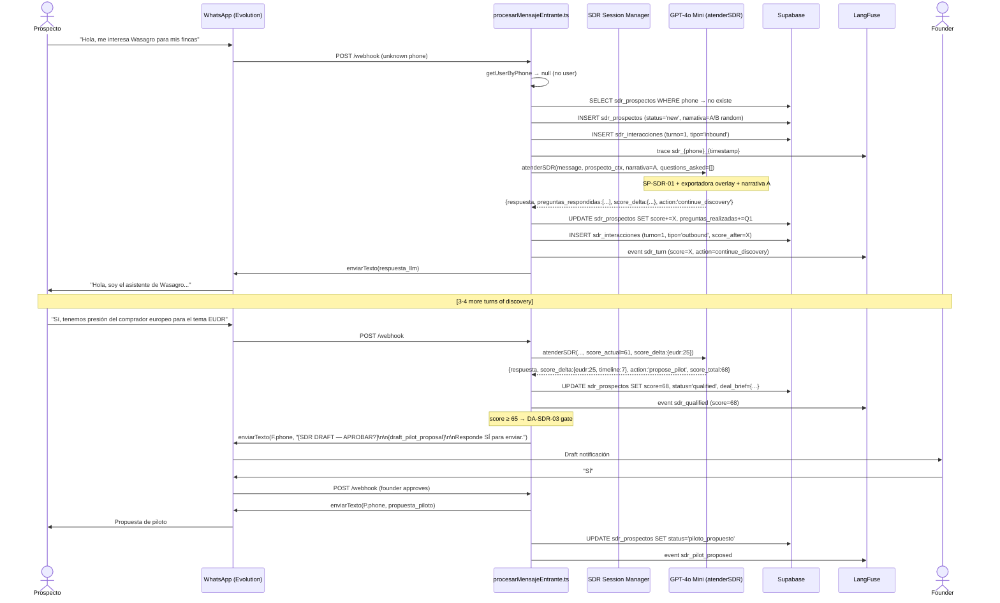
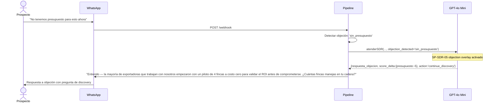
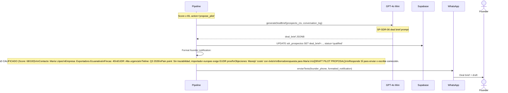

# Design: sdr-conversacional
> Change: sdr-conversacional | Phase: sdd-design | Date: 2026-04-23

---

## Architecture Overview

```
                        WASAGRO H0 — SDR Conversacional
                        ================================

  Unknown phone                  procesarMensajeEntrante.ts
  sends WhatsApp ─────────────►  router detects no user record
  message                         │
                                   ▼
                          ┌─────────────────┐
                          │  SDR Session    │
                          │  Manager        │
                          │                 │
                          │  - Load/create  │
                          │    sdr_prospectos│
                          │  - Load cross-  │
                          │    session ctx  │
                          │  - Seed question│
                          │    log          │
                          └────────┬────────┘
                                   │
                          ┌────────▼────────┐
                          │  SDR LLM        │
                          │  (atenderSDR)   │
                          │                 │
                          │  SP-SDR-01 +    │
                          │  segment overlay│
                          │  + objection    │
                          │    matrix       │
                          └────────┬────────┘
                                   │ returns SDRResponse
                                   ▼
                     ┌─────────────────────────┐
                     │  SDR Response Handler   │
                     │                         │
                     │  1. Update score         │
                     │  2. Log question answered│
                     │  3. Detect objection     │
                     │  4. Check score ≥ 65     │
                     │  5. Route to action      │
                     └───────────┬─────────────┘
                                 │
           ┌─────────────────────┼──────────────────────┐
           │                     │                      │
           ▼                     ▼                      ▼
  ┌──────────────┐    ┌──────────────────┐    ┌─────────────────┐
  │  Continue    │    │  Propose Pilot   │    │  Exit (score    │
  │  Discovery   │    │  (score ≥ 65)    │    │  < 30 or max    │
  │              │    │                  │    │  turns reached) │
  │  Auto-send   │    │  DRAFT → founder │    │                 │
  │  next Q      │    │  approval gate   │    │  Graceful close │
  └──────────────┘    │  (DA-SDR-03)     │    └─────────────────┘
                      └──────────────────┘
```

---

## SDR State Machine

```
                    [unknown phone contacts]
                            │
                            ▼
                    ┌───────────────┐
                    │   PROSPECT    │  sdr_prospectos.status = 'new'
                    │   IDENTIFIED  │
                    └───────┬───────┘
                            │ first message processed
                            ▼
                    ┌───────────────┐
                    │  DISCOVERY    │  status = 'en_discovery'
                    │  IN PROGRESS  │  score updated incrementally
                    └───────┬───────┘
                            │
              ┌─────────────┼──────────────┐
              │             │              │
              ▼             ▼              ▼
    ┌──────────────┐ ┌──────────────┐ ┌──────────────┐
    │  SCORE ≥ 65  │ │  SCORE < 30  │ │  MAX TURNS   │
    │  QUALIFIED   │ │  UNQUALIFIED │ │  REACHED (20)│
    └──────┬───────┘ └──────┬───────┘ └──────┬───────┘
           │                │                │
           ▼                ▼                ▼
   ┌──────────────┐ ┌──────────────┐ ┌──────────────┐
   │  PILOT       │ │  GRACEFUL    │ │  DORMANT     │
   │  PROPOSED    │ │  EXIT        │ │  (re-contact │
   │  (pending    │ │              │ │  re-activates│
   │   approval)  │ └──────────────┘ └──────────────┘
   └──────┬───────┘
          │ founder approves
          ▼
   ┌──────────────┐
   │  MEETING     │ sdr_prospectos.status = 'reunion_agendada'
   │  SCHEDULED   │ deal_brief generated
   └──────────────┘
```

---

## Sequence Diagrams

### SD-01: Nuevo prospecto — discovery hasta calificación



### SD-02: Objeción durante discovery



### SD-03: Deal brief y notificación al founder



---

## Data Model

### Table: sdr_prospectos

```sql
CREATE TABLE sdr_prospectos (
  id                    UUID PRIMARY KEY DEFAULT uuid_generate_v4(),
  phone                 TEXT NOT NULL UNIQUE,  -- E.164
  nombre                TEXT,
  empresa               TEXT,
  cargo                 TEXT,
  pais                  TEXT,
  segmento_icp          TEXT CHECK (segmento_icp IN ('exportadora', 'ong', 'gerente_finca', 'otro', 'desconocido')),
  narrativa_asignada    TEXT CHECK (narrativa_asignada IN ('A', 'B')),

  -- Qualification score (0-100)
  score_total           INTEGER NOT NULL DEFAULT 0,
  score_eudr_urgency    INTEGER NOT NULL DEFAULT 0,   -- max 25
  score_tamano_cartera  INTEGER NOT NULL DEFAULT 0,   -- max 20
  score_calidad_dato    INTEGER NOT NULL DEFAULT 0,   -- max 20
  score_champion        INTEGER NOT NULL DEFAULT 0,   -- max 15
  score_timeline        INTEGER NOT NULL DEFAULT 0,   -- max 10
  score_presupuesto     INTEGER NOT NULL DEFAULT 0,   -- max 10

  -- Discovery tracking
  preguntas_realizadas  JSONB NOT NULL DEFAULT '[]',  -- [{pregunta, respuesta, turn, dimension}]
  fincas_en_cartera     INTEGER,
  cultivo_principal     TEXT,
  eudr_urgency          TEXT CHECK (eudr_urgency IN ('alta', 'media', 'baja', 'ninguna', 'desconocida')),
  objeciones_manejadas  TEXT[] DEFAULT '{}',
  punto_de_dolor_principal TEXT,

  -- Session state
  status                TEXT NOT NULL DEFAULT 'new' CHECK (status IN (
    'new', 'en_discovery', 'qualified', 'unqualified',
    'piloto_propuesto', 'reunion_agendada', 'dormant', 'descartado'
  )),
  turns_total           INTEGER NOT NULL DEFAULT 0,
  primera_interaccion   TIMESTAMPTZ DEFAULT NOW(),
  ultima_interaccion    TIMESTAMPTZ DEFAULT NOW(),

  -- Handoff
  deal_brief            JSONB,
  founder_notified_at   TIMESTAMPTZ,
  reunion_agendada_at   TIMESTAMPTZ,

  created_at            TIMESTAMPTZ DEFAULT NOW(),
  updated_at            TIMESTAMPTZ DEFAULT NOW()
);
```

### Table: sdr_interacciones

```sql
CREATE TABLE sdr_interacciones (
  id               UUID PRIMARY KEY DEFAULT uuid_generate_v4(),
  prospecto_id     UUID NOT NULL REFERENCES sdr_prospectos(id),
  phone            TEXT NOT NULL,
  turno            INTEGER NOT NULL,
  tipo             TEXT NOT NULL CHECK (tipo IN ('inbound', 'outbound', 'draft_approval', 'founder_override')),
  contenido        TEXT NOT NULL,
  score_before     INTEGER,
  score_after      INTEGER,
  score_delta      JSONB,       -- {dimension: delta_value}
  objection_detected TEXT,
  action_taken     TEXT,        -- 'continue_discovery', 'propose_pilot', 'handle_objection', 'graceful_exit'
  narrativa        TEXT,        -- A or B
  langfuse_trace_id TEXT,
  created_at       TIMESTAMPTZ DEFAULT NOW()
);
```

---

## LangFuse Tracing Architecture

Every SDR interaction generates:

```
trace: sdr_{phone}_{timestamp}
├── span: sdr_session_load       — load/create sdr_prospectos record
├── span: sdr_llm_call           — GPT-4o Mini call with full prompt
│   ├── input: {message, ctx, score, questions_asked, narrativa}
│   ├── output: {respuesta, score_delta, action, preguntas_respondidas}
│   └── metadata: {model, tokens, latency_ms, cost_usd}
├── span: sdr_score_update       — update score dimensions
├── span: sdr_objection_handled  — if objection detected
├── event: sdr_turn              — {turn_number, score_after, action}
├── event: sdr_qualified         — only when score ≥ 65
├── event: sdr_founder_notified  — when draft sent to founder
└── event: sdr_pilot_proposed    — when founder approves and message sent
```

Scores tracked as LangFuse Score objects per trace for aggregate analytics.

---

## Integration Points

### procesarMensajeEntrante.ts routing

```typescript
// After getUserByPhone returns null:
// 1. Check sdr_prospectos by phone
// 2. If exists → continue SDR session
// 3. If not exists → create sdr_prospectos + start SDR session
// 4. Route to handleSDRSession()
```

### IWasagroLLM interface extension

```typescript
interface IWasagroLLM {
  // ... existing methods
  atenderSDR(entrada: EntradaSDR, traceId: string): Promise<RespuestaSDR>
}

interface EntradaSDR {
  mensaje: string
  prospecto: SDRProspectoContext
  narrativa: 'A' | 'B'
  preguntas_realizadas: PreguntaRealizada[]
  score_actual: number
  turno: number
  objection_detected?: string
}

interface RespuestaSDR {
  respuesta: string
  preguntas_respondidas: PreguntaRespondida[]
  score_delta: ScoreDelta
  action: 'continue_discovery' | 'propose_pilot' | 'graceful_exit' | 'handle_objection'
  objection_type?: string
  requires_founder_approval: boolean
  deal_brief?: DealBrief
}
```

---

## File Changes

| File | Action | Description |
|------|--------|-------------|
| `supabase/migrations/20260101000012_add-sdr-prospectos.sql` | Create | sdr_prospectos table |
| `supabase/migrations/20260101000013_add-sdr-interacciones.sql` | Create | sdr_interacciones table |
| `src/types/dominio/SDRTypes.ts` | Create | TypeScript types for SDR |
| `src/pipeline/supabaseQueries.ts` | Modify | Add SDR query functions |
| `src/pipeline/procesarMensajeEntrante.ts` | Modify | SDR session routing |
| `src/agents/sdrAgent.ts` | Create | SDR session manager |
| `src/integrations/llm/IWasagroLLM.ts` | Modify | Add atenderSDR() to interface |
| `src/integrations/llm/GeminiLLM.ts` | Modify | Implement atenderSDR() |
| `src/integrations/llm/OllamaLLM.ts` | Modify | Implement atenderSDR() |
| `prompts/SP-SDR-01-master.md` | Create | Master SDR system prompt |
| `prompts/SP-SDR-02-exportadora.md` | Create | Exportadora overlay |
| `prompts/SP-SDR-03-ong.md` | Create | ONG overlay |
| `prompts/SP-SDR-04-gerente-finca.md` | Create | Gerente finca overlay |
| `prompts/SP-SDR-05-objections.md` | Create | Objection matrix prompt |
| `prompts/SP-SDR-06-handoff.md` | Create | Deal brief generation prompt |
| `sdr/playbooks/*.md` | Create | 6 playbook documents |
| `tests/pipeline/sdrAgent.test.ts` | Create | SDR agent unit tests |
| `tests/integrations/llm/GeminiSDR.test.ts` | Create | LLM atenderSDR tests |
